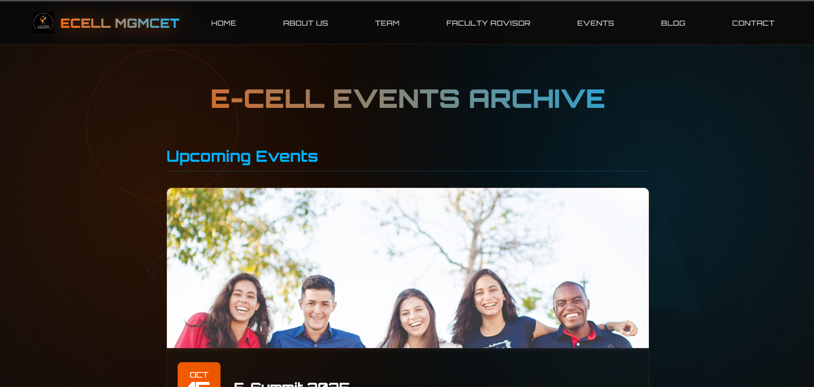

# 🚀 E-Cell MGMCET: Official Website

This repository contains the source code for the official website of the **Entrepreneurship Cell (E-Cell) at MGMCET,Kamothe,Navi Mumbai**. The website is built with a modern, futuristic aesthetic to engage and inform students about the E-Cell's mission, events, team, and resources.

---

## ✨ Features

The website is a multi-page, responsive platform that includes:

1.  **Home Page:** A dynamic landing page with an animated hero section, an interactive "About Us" tab system, and sections for the Faculty Advisor and contact information.
2.  **Team Page:** A comprehensive roster of all E-Cell team members, complete with a filtering system to view members by their specific teams (Executive, Technical, Events, etc.).
3.  **Events Page:** A detailed archive of upcoming and past events, featuring expandable cards for more information and links to event galleries.
4.  **Blog Platform:** A rich content hub with a filterable main page and individual article pages that include a reading progress bar, a floating table of contents, and social sharing functionality.
5.  **Responsive Design:** The layout is fully optimized to adapt seamlessly across desktops, tablets, and mobile devices.
6.  **Interactive UI/UX:** Features a "futuristic" theme with animated backgrounds, particle effects, and scanlines to create a highly engaging user experience.

---

## 💻 Tech Stack

| Component | Technology | Role in Project |
| :--- | :--- | :--- |
| **Frontend** | **HTML5** | Structures the content and layout of all pages. |
| **Styling** | **CSS3** | Powers the design, animations, and responsive layout. |
| **Interactivity** | **JavaScript** | Drives dynamic features like the mobile menu, blog filters, and interactive UI elements. |

---

## 📸 Website Screenshots

<h3 align="center">Website Showcase</h3>

<table width="100%">
  <tr>
    <td align="center">
      <a href="assets\screenshot\home.png"></a>
      <br>
      <p><strong>[1. Home Page]</strong></p>
    </td>
  </tr>
  <tr>
    <td align="center">
      <a href="assets\screenshot\blogs.png"></a>
      <br>
      <p><strong>[2. Blogs Page]</strong></p>
    </td>
  </tr>
  <tr>
    <td align="center">
      <a href="assets/screenshot/events.png"></a>
      <br>
      <p><strong>[3. Events Page]</strong></p>
    </td>
  </tr>
  <tr>
    <td align="center">
      <a href="assets\screenshot\blog_page.png"></a>
      <br>
      <p><strong>[4. Blog Post with Table of Contents]</strong></p>
    </td>
  </tr>
</table>

---

## 🛠️ Getting Started

Follow these steps to set up and run the project locally.

### Prerequisites

* A modern web browser (e.g., Chrome, Firefox, Safari).

### Installation & Setup

1.  **Clone the Repository:**
    ```bash
    git clone https://github.com/def-hrithik/E-Cell.git
    cd E-Cell
    ```
2.  **Run the Website:**
    * Simply open the `index.html` file in your web browser to view the website. No special server or build process is required.

---

## 🤝 Contributing

Contributions are not welcome at this time. This project is currently not open for pull requests or feature suggestions.


**Project Link:** [https://github.com/def-hrithik/E-Cell.git]
